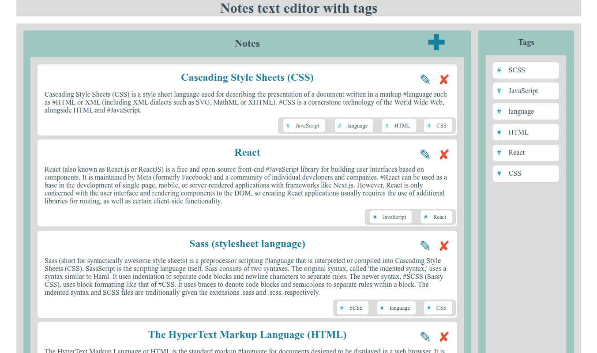
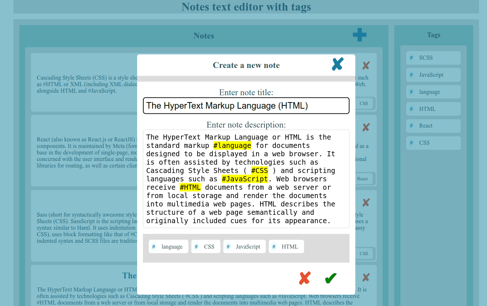

# Notes text editor with tags.

> Single page application in React for quick notes. 


---

[Description](#description) •
[Project setup](#project-setup) •
[Features](#features) •
[How To Use](#how-to-use) •
[Project Status](#project-status) •
[Room for Improvement](#room-for-improvement) •
[License](#license) •
[Contact](#contact)




## Description

 SPA in React, TypeScript and Sass for quick notes. 
 Create, edit, view and delete notes. 
 While editing a note, user can create tags using the '#' symbol. When editing a note, all words that match the tags are highlighted.

## Project setup

- Clone this repo to your desktop and run ```yarn``` or ```npm install``` to install all the dependencies.
- Once the dependencies are installed, you can run ```yarn dev``` or ```npm dev``` to start the application.
- Enjoy.

## Features
- Filter notes by tag.
- JSON in-memory database.
- Using contenteditable textarea.

## How To Use

Run [Live Demo](https://euphonious-heliotrope-5b2c49.netlify.app/)

![tutorial][tutorial]

## Project Status

Project is: *in progress*

## Room for Improvement

To do:
- [ ] Add popovers to button

Improvement:
- [ ] move from in-memory database to server

## License

This project is open source and available under the [MIT](../LICENSE).

## Contact
Created by [@RimidalU](https://www.linkedin.com/in/uladzimir-stankevich/) - feel free to contact me!

<p align="right"><a href="#start"></a></p>

<!-- MARKDOWN LINKS & IMAGES -->
<!-- [tutorial]: ./assets/screencast.webp -->
[tutorial]: ./assets/demo.webp
